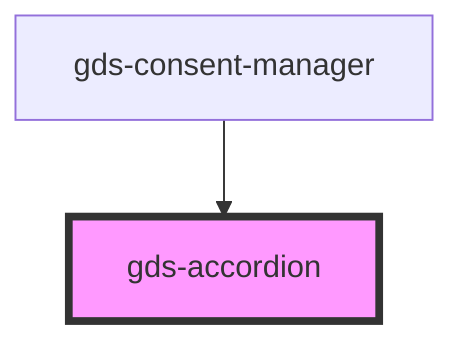

# gds-button

<!-- Auto Generated Below -->

## Properties

| Property        | Attribute        | Description                                                                    | Type      | Default |
| --------------- | ---------------- | ------------------------------------------------------------------------------ | --------- | ------- |
| `contentFloats` | `content-floats` | Content floats.                                                                | `boolean` | `false` |
| `expanded`      | `expanded`       | Keeps track of when the user has actively collapsed or expanded the accordion. | `boolean` | `false` |
| `openOnHover`   | `open-on-hover`  | Opens automatically when hovered (desktop only).                               | `boolean` | `false` |
| `useTransition` | `use-transition` | Content floats.                                                                | `boolean` | `false` |

## Slots

| Slot              | Description                       |
| ----------------- | --------------------------------- |
| `"content"`       | the hidden part of the accordion  |
| `"icon-collapse"` |                                   |
| `"icon-expand"`   |                                   |
| `"label"`         | the heading part of the accordion |

## CSS Custom Properties

| Name                                         | Description |
| -------------------------------------------- | ----------- |
| `--gds-accordion-background`                 |             |
| `--gds-accordion-border`                     |             |
| `--gds-accordion-border-radius`              |             |
| `--gds-accordion-box-shadow`                 |             |
| `--gds-accordion-color`                      |             |
| `--gds-accordion-content-background`         |             |
| `--gds-accordion-expanded-header-background` |             |
| `--gds-accordion-header-padding`             |             |
| `--gds-accordion-heading-margin-left`        |             |
| `--gds-accordion-justify-content`            |             |
| `--gds-accordion-outline-focus`              |             |
| `--gds-accordion-padding`                    |             |
| `--gds-accordion-transition`                 |             |

## Dependencies

### Used by

 - [gds-consent-manager](../gds-consent-manager)

### Graph

----------------------------------------------

*Built with [StencilJS](https://stenciljs.com/)*
