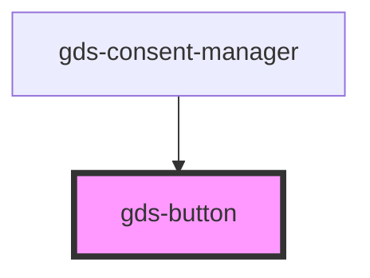

# gds-button

<!-- Auto Generated Below -->

## Properties

| Property          | Attribute           | Description                                                                    | Type      | Default     |
| ----------------- | ------------------- | ------------------------------------------------------------------------------ | --------- | ----------- |
| `disabled`        | `disabled`          |                                                                                | `boolean` | `false`     |
| `leftIcon`        | `left-icon`         | Left side icon with a font. https://www.martinstoeckli.ch/fontmap/fontmap.html | `string`  | `undefined` |
| `leftIconRotate`  | `left-icon-rotate`  |                                                                                | `number`  | `undefined` |
| `rightIcon`       | `right-icon`        | Right side icon with a font.                                                   | `string`  | `undefined` |
| `rightIconRotate` | `right-icon-rotate` |                                                                                | `number`  | `undefined` |
| `size`            | `size`              | Button size.                                                                   | `string`  | `'m'`       |

## Dependencies

### Used by

 - [gds-consent-manager](../gds-consent-manager)

### Graph

----------------------------------------------

*Built with [StencilJS](https://stenciljs.com/)*
