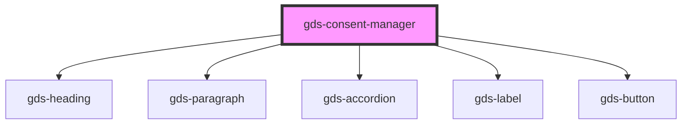

# gds-button

<!-- Auto Generated Below -->

## Properties

| Property             | Attribute             | Description        | Type      | Default                |
| -------------------- | --------------------- | ------------------ | --------- | ---------------------- |
| `accordionIsOpen`    | `accordion-is-open`   |                    | `boolean` | `false`                |
| `configs`            | `configs`             |                    | `string`  | `undefined`            |
| `description`        | `description`         | Define description | `string`  | `undefined`            |
| `headline`           | `headline`            | Define headline    | `string`  | `undefined`            |
| `isopen`             | `isopen`              | Mutables           | `boolean` | `true`                 |
| `language`           | `language`            | Set language       | `string`  | `this.defaultLanguage` |
| `languageNavigation` | `language-navigation` |                    | `boolean` | `true`                 |

## Events

| Event     | Description                                   | Type               |
| --------- | --------------------------------------------- | ------------------ |
| `consent` | Creates an Event that a hook can be hooked to | `CustomEvent<any>` |

## Slots

| Slot        | Description                             |
| ----------- | --------------------------------------- |
| `"content"` | the hidden part of the consent manager  |
| `"label"`   | the heading part of the consent manager |

## CSS Custom Properties

| Name                              | Description |
| --------------------------------- | ----------- |
| `--gds-consent-manager-max-width` |             |

## Dependencies

### Depends on

- [gds-heading](../gds-heading)
- [gds-paragraph](../gds-paragraph)
- [gds-accordion](../gds-accordion)
- [gds-label](../gds-label)
- [gds-button](../gds-button)

### Graph

----------------------------------------------

*Built with [StencilJS](https://stenciljs.com/)*
