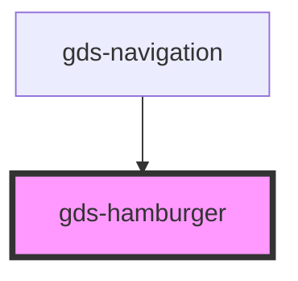

# gds-hamburger

<!-- Auto Generated Below -->

## Properties

| Property          | Attribute          | Description | Type      | Default     |
| ----------------- | ------------------ | ----------- | --------- | ----------- |
| `accessibleLabel` | `accessible-label` |             | `string`  | `undefined` |
| `active`          | `active`           |             | `boolean` | `false`     |
| `label`           | `label`            |             | `string`  | `undefined` |

## Dependencies

### Used by

 - [gds-navigation](../gds-navigation)

### Graph

----------------------------------------------

*Built with [StencilJS](https://stenciljs.com/)*
