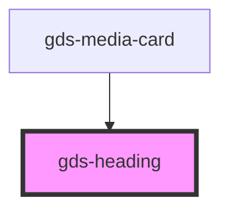

# gds-heading

<!-- Auto Generated Below -->

## Properties

| Property | Attribute | Description                                                                                                                                                 | Type     | Default     |
| -------- | --------- | ----------------------------------------------------------------------------------------------------------------------------------------------------------- | -------- | ----------- |
| `as`     | `as`      | Render the heading as a h element for SEO purposes.  Those h element should be visible to GoogleBot: https://www.searchenginejournal.com/shadow-dom/353644/ | `string` | `undefined` |
| `size`   | `size`    | Size of the heading.                                                                                                                                        | `string` | `'m'`       |

## Dependencies

### Used by

 - [gds-media-card](../gds-media-card)

### Graph

----------------------------------------------

*Built with [StencilJS](https://stenciljs.com/)*
