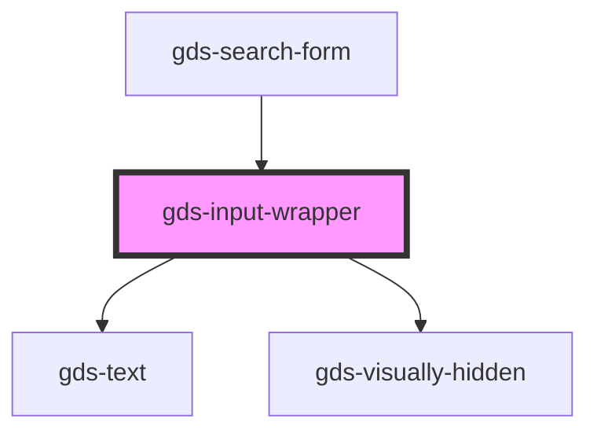

# gds-text-button

<!-- Auto Generated Below -->

## Properties

| Property            | Attribute             | Description                                | Type      | Default     |
| ------------------- | --------------------- | ------------------------------------------ | --------- | ----------- |
| `error`             | `error`               | TODO: Add this feature.                    | `string`  | `undefined` |
| `hideLabelVisually` | `hide-label-visually` | Visually hide the label                    | `boolean` | `false`     |
| `label`             | `label`               | Display the label above the input element. | `string`  | `undefined` |

## Dependencies

### Used by

 - [gds-search-form](../gds-search-form)

### Depends on

- [gds-text](../gds-text)
- [gds-visually-hidden](../gds-visually-hidden)

### Graph

----------------------------------------------

*Built with [StencilJS](https://stenciljs.com/)*
