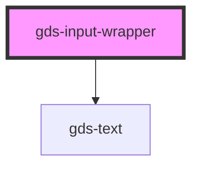

# gds-text-button

<!-- Auto Generated Below -->

## Properties

| Property | Attribute | Description                                | Type     | Default     |
| -------- | --------- | ------------------------------------------ | -------- | ----------- |
| `error`  | `error`   | TODO: Add this feature.                    | `string` | `undefined` |
| `label`  | `label`   | Display the label above the input element. | `string` | `undefined` |

## Dependencies

### Depends on

- [gds-text](../gds-text)

### Graph

----------------------------------------------

*Built with [StencilJS](https://stenciljs.com/)*
