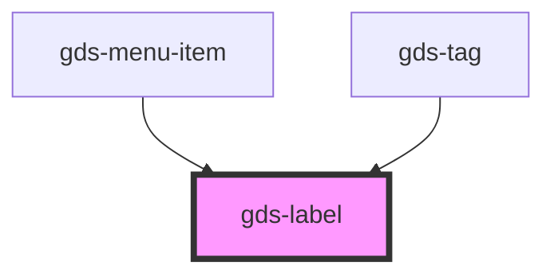

# gds-label

<!-- Auto Generated Below -->

## Properties

| Property | Attribute | Description                                                   | Type     | Default     |
| -------- | --------- | ------------------------------------------------------------- | -------- | ----------- |
| `color`  | `color`   | Text color. TODO: Implement the color custom variable scheme. | `string` | `undefined` |
| `size`   | `size`    | Size of the label.                                            | `string` | `'m'`       |

## Dependencies

### Used by

 - [gds-menu-item](../gds-menu-item)
 - [gds-tag](../gds-tag)

### Graph

----------------------------------------------

*Built with [StencilJS](https://stenciljs.com/)*
