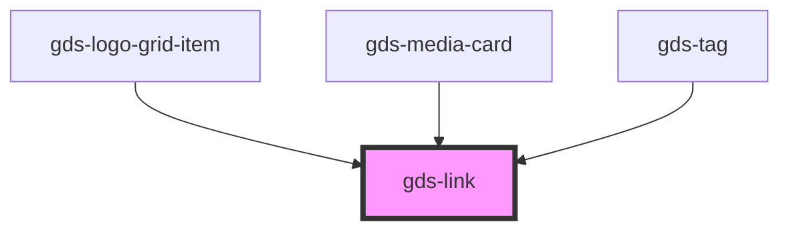

# gds-link

<!-- Auto Generated Below -->

## Properties

| Property          | Attribute          | Description                                          | Type      | Default     |
| ----------------- | ------------------ | ---------------------------------------------------- | --------- | ----------- |
| `ariaLabel`       | `aria-label`       | Block element.                                       | `string`  | `undefined` |
| `block`           | `block`            | Block element.                                       | `boolean` | `undefined` |
| `full`            | `full`             | Expand across container.                             | `boolean` | `undefined` |
| `href`            | `href`             | Link url.                                            | `string`  | `undefined` |
| `rel`             | `rel`              | Link rel. (can be used for nofollow, sponsored etc.) | `string`  | `undefined` |
| `target`          | `target`           | Link open target.                                    | `string`  | `undefined` |

## Dependencies

### Used by

 - [gds-logo-grid-item](../gds-logo-grid-item)
 - [gds-media-card](../gds-media-card)
 - [gds-tag](../gds-tag)

### Graph

----------------------------------------------

*Built with [StencilJS](https://stenciljs.com/)*
