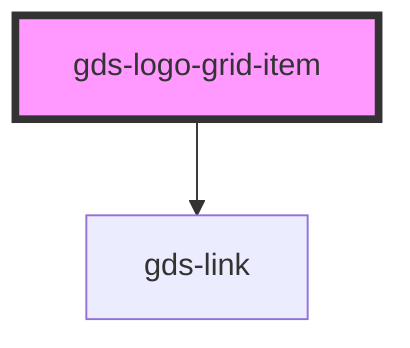

# gds-logo-grid-item

<!-- Auto Generated Below -->

## Properties

| Property   | Attribute   | Description                          | Type     | Default     |
| ---------- | ----------- | ------------------------------------ | -------- | ----------- |
| `href`     | `href`      | If defined, the logo will be a link. | `string` | `undefined` |
| `imageUrl` | `image-url` | Image url.                           | `string` | `undefined` |
| `target`   | `target`    | Link open target.                    | `string` | `undefined` |

## Dependencies

### Depends on

- [gds-link](../gds-link)

### Graph

----------------------------------------------

*Built with [StencilJS](https://stenciljs.com/)*
