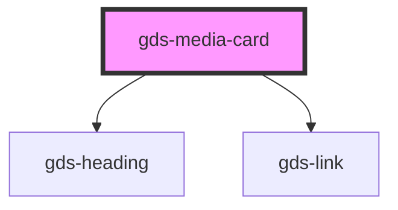

# gds-media-card

<!-- Auto Generated Below -->

## Properties

| Property               | Attribute                | Description                                          | Type     | Default     |
| ---------------------- | ------------------------ | ---------------------------------------------------- | -------- | ----------- |
| `description`          | `description`            | TODO: implement this.                                | `string` | `undefined` |
| `headline`             | `headline`               | Title for the card (note: title is a reserved word). | `string` | `undefined` |
| `href`                 | `href`                   | If defined, the card will be a link.                 | `string` | `undefined` |
| `imageUrl`             | `image-url`              | Image url.                                           | `string` | `undefined` |
| `superimposedImageFit` | `superimposed-image-fit` | Superimposed image fit. TODO: implement this.        | `string` | `undefined` |
| `superimposedImageUrl` | `superimposed-image-url` | Superimposed image url. TODO: implement this.        | `string` | `undefined` |
| `target`               | `target`                 | Link open target.                                    | `string` | `undefined` |

## Dependencies

### Depends on

- [gds-heading](../gds-heading)
- [gds-link](../gds-link)

### Graph

---

_Built with [StencilJS](https://stenciljs.com/)_
