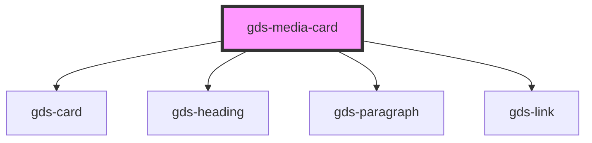

# gds-media-card

<!-- Auto Generated Below -->

## Properties

| Property             | Attribute             | Description                                          | Type      | Default     |
| -------------------- | --------------------- | ---------------------------------------------------- | --------- | ----------- |
| `description`        | `description`         |                                                      | `string`  | `undefined` |
| `headline`           | `headline`            | Title for the card (note: title is a reserved word). | `string`  | `undefined` |
| `href`               | `href`                | If defined, the card will be a link.                 | `string`  | `undefined` |
| `imageUrl`           | `image-url`           | Image url.                                           | `string`  | `undefined` |
| `overlay`            | `overlay`             | Overlay.                                             | `boolean` | `undefined` |
| `overlayEffect`      | `overlay-effect`      | Overlay effect.                                      | `string`  | `undefined` |
| `superimposedBottom` | `superimposed-bottom` |                                                      | `string`  | `undefined` |
| `superimposedLeft`   | `superimposed-left`   |                                                      | `string`  | `undefined` |
| `superimposedRight`  | `superimposed-right`  |                                                      | `string`  | `undefined` |
| `superimposedTop`    | `superimposed-top`    | superimpose image overflow amount in pixels.         | `string`  | `undefined` |
| `superimposedUrl`    | `superimposed-url`    | superimpose image url.                               | `string`  | `undefined` |
| `target`             | `target`              | Link open target.                                    | `string`  | `undefined` |

## Dependencies

### Depends on

- [gds-card](../gds-card)
- [gds-heading](../gds-heading)
- [gds-paragraph](../gds-paragraph)
- [gds-link](../gds-link)

### Graph

----------------------------------------------

*Built with [StencilJS](https://stenciljs.com/)*
