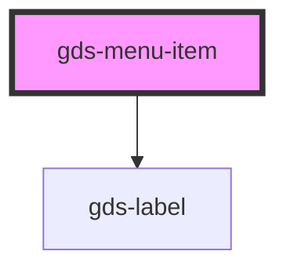

# gds-logo-grid

<!-- Auto Generated Below -->

## Properties

| Property | Attribute | Description                 | Type      | Default     |
| -------- | --------- | --------------------------- | --------- | ----------- |
| `active` | `active`  | Is menu item appear active. | `boolean` | `undefined` |

## Dependencies

### Depends on

- [gds-label](../gds-label)

### Graph

----------------------------------------------

*Built with [StencilJS](https://stenciljs.com/)*
