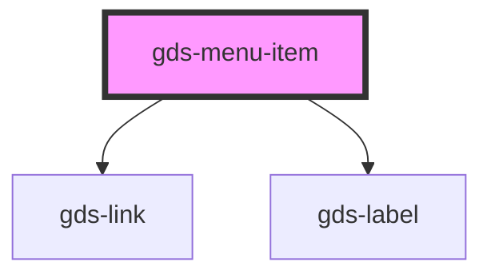

# gds-logo-grid

<!-- Auto Generated Below -->

## Properties

| Property  | Attribute | Description                                                       | Type      | Default     |
| --------- | --------- | ----------------------------------------------------------------- | --------- | ----------- |
| `divider` | `divider` | Can be used to divide menu items. TODO: Implement desktop styles. | `boolean` | `undefined` |
| `href`    | `href`    | Link url.                                                         | `string`  | `undefined` |

## Dependencies

### Depends on

- [gds-link](../gds-link)
- [gds-label](../gds-label)

### Graph

----------------------------------------------

*Built with [StencilJS](https://stenciljs.com/)*
