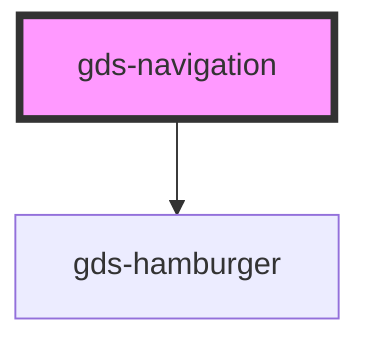

# gds-logo-grid

<!-- Auto Generated Below -->

## Properties

| Property                    | Attribute                     | Description                              | Type     | Default     |
| --------------------------- | ----------------------------- | ---------------------------------------- | -------- | ----------- |
| `accessibleHamburgerLabel`  | `accessible-hamburger-label`  | Accessible label for the hamburger menu  | `string` | `undefined` |
| `accessibleNavigationLabel` | `accessible-navigation-label` | Accessible name for the inner navigation | `string` | `undefined` |

## Events

| Event                | Description                              | Type                |
| -------------------- | ---------------------------------------- | ------------------- |
| `closeHamburgerMenu` | Public event when mobile menu is closed. | `CustomEvent<void>` |
| `openHamburgerMenu`  | Public event when mobile menu is opened. | `CustomEvent<void>` |

## Methods

### `closeMenu() => Promise<void>`

#### Returns

Type: `Promise<void>`

## Dependencies

### Depends on

- [gds-hamburger](../gds-hamburger)

### Graph

----------------------------------------------

*Built with [StencilJS](https://stenciljs.com/)*
