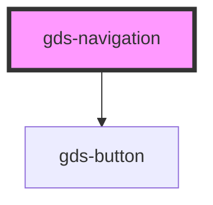

# gds-logo-grid

<!-- Auto Generated Below -->

## Properties

| Property      | Attribute     | Description                                | Type      | Default     |
| ------------- | ------------- | ------------------------------------------ | --------- | ----------- |
| `transparent` | `transparent` | Does the navigation appear as transparent. | `boolean` | `undefined` |

## Dependencies

### Depends on

- [gds-button](../gds-button)

### Graph

----------------------------------------------

*Built with [StencilJS](https://stenciljs.com/)*
