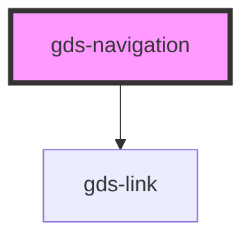

# gds-logo-grid

<!-- Auto Generated Below -->

## Properties

| Property  | Attribute  | Description          | Type     | Default     |
| --------- | ---------- | -------------------- | -------- | ----------- |
| `homeUrl` | `home-url` | Site url.            | `string` | `undefined` |
| `logoUrl` | `logo-url` | Site logo image url. | `string` | `undefined` |

## Dependencies

### Depends on

- [gds-link](../gds-link)

### Graph

----------------------------------------------

*Built with [StencilJS](https://stenciljs.com/)*
