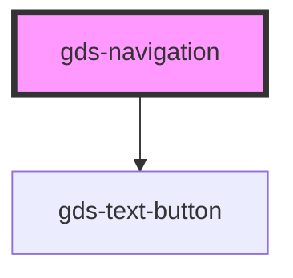

# gds-logo-grid

<!-- Auto Generated Below -->

## Properties

| Property                    | Attribute                     | Description                               | Type     | Default     |
| --------------------------- | ----------------------------- | ----------------------------------------- | -------- | ----------- |
| `navigationAccessibleLabel` | `navigation-accessible-label` | Accessible label for the inner navigation | `string` | `undefined` |

## Methods

### `closeMenu() => Promise<void>`

#### Returns

Type: `Promise<void>`

## Dependencies

### Depends on

- [gds-text-button](../gds-text-button)

### Graph

----------------------------------------------

*Built with [StencilJS](https://stenciljs.com/)*
