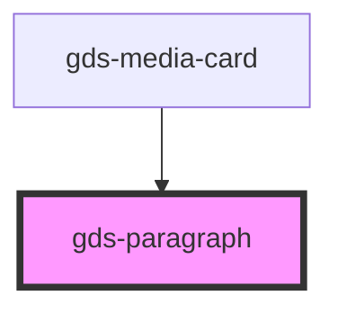

# gds-heading

<!-- Auto Generated Below -->

## Properties

| Property | Attribute | Description                        | Type     | Default     |
| -------- | --------- | ---------------------------------- | -------- | ----------- |
| `class`  | `class`   | Use to override p element's style. | `string` | `undefined` |
| `size`   | `size`    | Size of the text.                  | `string` | `'m'`       |

## Dependencies

### Used by

 - [gds-media-card](../gds-media-card)

### Graph

----------------------------------------------

*Built with [StencilJS](https://stenciljs.com/)*
