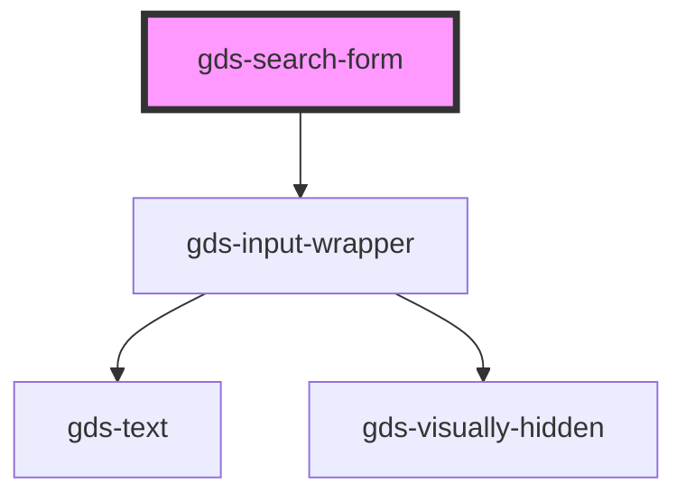

# gds-search

<!-- Auto Generated Below -->

## Properties

| Property                | Attribute                 | Description | Type      | Default     |
| ----------------------- | ------------------------- | ----------- | --------- | ----------- |
| `accessibleInputLabel`  | `accessible-input-label`  |             | `string`  | `'Search'`  |
| `accessibleSubmitLabel` | `accessible-submit-label` |             | `string`  | `'Search'`  |
| `action`                | `action`                  |             | `string`  | `undefined` |
| `collapsed`             | `collapsed`               |             | `boolean` | `false`     |
| `floating`              | `floating`                |             | `boolean` | `false`     |
| `placeholder`           | `placeholder`             |             | `string`  | `'Search'`  |
| `query`                 | `query`                   |             | `string`  | `'s'`       |

## Dependencies

### Depends on

- [gds-input-wrapper](../gds-input-wrapper)

### Graph

----------------------------------------------

*Built with [StencilJS](https://stenciljs.com/)*
