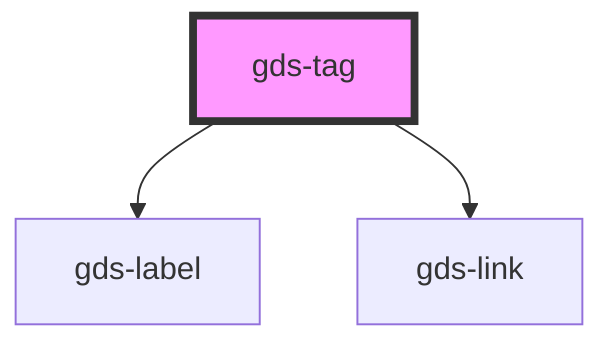

# gds-label

<!-- Auto Generated Below -->

## Properties

| Property | Attribute | Description                         | Type     | Default     |
| -------- | --------- | ----------------------------------- | -------- | ----------- |
| `href`   | `href`    | If defined, the tag will be a link. | `string` | `undefined` |
| `target` | `target`  | Link open target.                   | `string` | `undefined` |

## Dependencies

### Depends on

- [gds-label](../gds-label)
- [gds-link](../gds-link)

### Graph

----------------------------------------------

*Built with [StencilJS](https://stenciljs.com/)*
