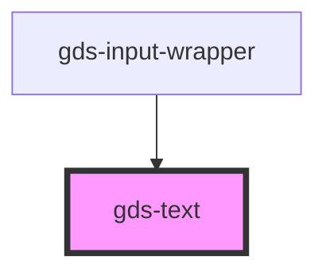

# gds-heading

<!-- Auto Generated Below -->

## Properties

| Property | Attribute | Description       | Type     | Default |
| -------- | --------- | ----------------- | -------- | ------- |
| `size`   | `size`    | Size of the text. | `string` | `'m'`   |

## Dependencies

### Used by

 - [gds-input-wrapper](../gds-input-wrapper)

### Graph

----------------------------------------------

*Built with [StencilJS](https://stenciljs.com/)*
