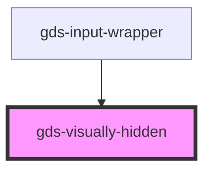

# gds-visually-hidden

<!-- Auto Generated Below -->

## Properties

| Property    | Attribute | Description | Type      | Default |
| ----------- | --------- | ----------- | --------- | ------- |
| `focusable` | --        |             | `Boolean` | `false` |

## Dependencies

### Used by

 - [gds-input-wrapper](../gds-input-wrapper)

### Graph

----------------------------------------------

*Built with [StencilJS](https://stenciljs.com/)*
